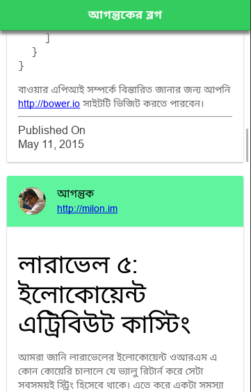

# Simple Ionic App for [http://milon.im](http://milon.im)

This is a simple hybrid app using Ionic Framework. This app simply loads the
posts from [http://milon.im](http://milon.im) using
WordPress public API and shows them in the App.

### Requirements

You workstation needs to be nodejs and npm installed. then install ionic and
cordova using following command-

```
npm install cordova ionic
```


### Installation

Just clone the app using following command-

```
git clone https://github.com/milon521/blog-ionic-app.git
```

Then cd into the folder using-
```
cd blog-ionic-app
```

Then install dependency using the following command-

```
npm install
```

Then run the ionic app using the following command-

```
ionic serve
```

Then visit to http://localhost:8100 to show app.

### Screenshot



### Suggesstion

Any suggesstion or pull request is welcome. Please contact in email-

milon521@gmail.com
